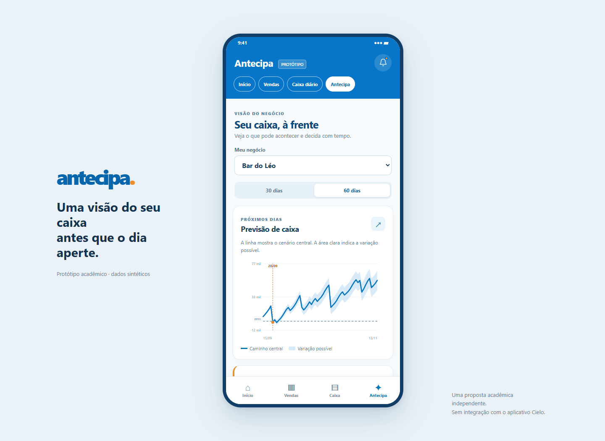
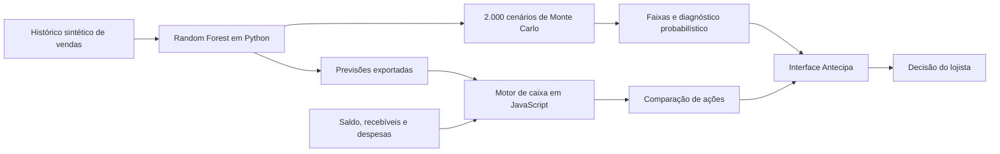

# Antecipa

### Uma visão do seu caixa antes que o dia aperte.

**Copiloto de caixa para pequenos negócios, desenvolvido para o desafio Cielo no II Inovathon SemAd 2026 — UFSCar.**

[](https://github.com/rhedymarques/antecipa-inovathon/actions/workflows/verify.yml)


**[▶ Abrir demonstração — sem instalação](https://rhedymarques.github.io/antecipa-inovathon/prototipo/)**

[Conheça a proposta](docs/PROPOSTA.md) · [Execute localmente](#execute-a-demonstração) · [Entenda o método](docs/METODOLOGIA.md) · [Explore o código](#mapa-do-repositório)



> Projeto acadêmico independente. Não é um produto oficial da Cielo e não possui integração com a empresa. Todos os negócios, dados, taxas e cenários são sintéticos.

## O problema que queremos resolver

Vender bem não significa ter dinheiro disponível no dia de pagar as contas. O Antecipa combina vendas previstas, recebíveis, saldo e despesas para mostrar **quando o caixa pode apertar**, distinguir um problema de **prazo** de um problema de **margem** e comparar o custo das alternativas.

A proposta começa pelo diagnóstico: antecipação não é a resposta automática. A análise pode sugerir acompanhamento, apontar uma medida parcial ou recusar uma alternativa cara. O lojista vê as hipóteses e decide; nenhuma transação é executada.

## O que você pode explorar

| Etapa | O que o protótipo entrega |
| --- | --- |
| Prever | Projeção de caixa em 30 e 60 dias, com uma faixa de incerteza do cenário-base. |
| Entender | Diagnóstico de prazo, margem ou situação saudável e possibilidade simulada de saldo negativo. |
| Comparar | Negociação com fornecedor, redução de gastos, antecipação, formas de pagamento e campanhas por produto. |
| Decidir | Custos, efeitos, limitações e um plano consultivo válido apenas na sessão. |

**Dois negócios guiam a apresentação:** Bar do Léo e Linha & Cor. Mercado Bom Preço e Café Primeiro Passo permanecem como casos técnicos para testar margem e pouco histórico.

## Execute a demonstração

**Para experimentar agora:** abra a [demonstração pública](https://rhedymarques.github.io/antecipa-inovathon/prototipo/) no navegador, sem instalação. Os dados e as notificações são simulados.

**Para executar no seu computador**, siga os passos abaixo.

Você só precisa de **Python 3.12+ e um navegador**. Não há build, login, chave de API ou instalação de bibliotecas para visualizar o protótipo: as previsões já estão incluídas.

```bash
git clone https://github.com/rhedymarques/antecipa-inovathon.git
cd antecipa-inovathon
python -m http.server 8765 --bind 127.0.0.1
```

Abra **[http://127.0.0.1:8765/prototipo/](http://127.0.0.1:8765/prototipo/)**. No Windows, se o comando `python` não estiver disponível, use `py -3 -m http.server 8765 --bind 127.0.0.1`.

Mantenha o terminal aberto. Para encerrar, pressione `Ctrl+C`. É necessário servir a **raiz do repositório**, porque a interface lê arquivos em `dist/`; abrir o HTML por duplo clique não funciona.

### Um roteiro de três minutos

1. Abra **Bar do Léo**, em **60 dias**, e observe a curva e o alerta de prazo.
2. Leia a sugestão e compare custo e efeito das medidas. Observe quando a melhora é apenas parcial.
3. Abra **Entender esta campanha** e explore o combo proposto. Descontos inviáveis são recusados pela análise.
4. Troque para **Linha & Cor** e compare **30 e 60 dias**: uma situação saudável no curto prazo pode esconder um aperto mais à frente.
5. Abra **Como calculamos esta demonstração** para consultar método, métricas e hipóteses.

O [guia da interface](prototipo/LEIA-ME.md) detalha os controles. O [painel técnico em `dist/`](http://127.0.0.1:8765/dist/) permite explorar os quatro casos e a cobertura dos dados, usando o mesmo servidor local.

## Como funciona



O modelo estima **vendas**; o motor transforma essas vendas em recebimentos e calcula o caixa. As previsões são treinadas previamente em Python. O navegador recalcula os efeitos das ações, mas **não retreina o modelo nem recalcula as faixas de Monte Carlo**.

Consulte [arquitetura e contratos](docs/ARQUITETURA.md) e [metodologia, avaliação e limitações](docs/METODOLOGIA.md).

## Verificação e reprodução

Para testar as regras do motor, com **Node.js 24**:

```bash
node work/test_engine.js
```

A suíte verifica conservação do caixa, dimensionamento da antecipação, limites de custo, veto de antecipação em margem, estoque e efeitos de promoções, além da consistência dos cenários. As verificações também rodam no [GitHub Actions](https://github.com/rhedymarques/antecipa-inovathon/actions).

Para recriar a base e treinar os modelos, siga o [guia de reprodução](docs/REPRODUCAO.md). Esse processo instala as dependências de Python e sobrescreve os dados gerados; não é necessário para abrir a demonstração.

## Mapa do repositório

| Caminho | Conteúdo |
| --- | --- |
| [`prototipo/`](prototipo/) | Interface principal da apresentação, em HTML, CSS e JavaScript. |
| [`dist/engine.js`](dist/engine.js) | Motor compartilhado de caixa, diagnóstico e comparação de ações. |
| [`dist/data.json`](dist/data.json) | Dados, previsões e cenários previamente calculados. |
| [`dist/`](dist/) | Painel técnico e arquivos servidos. **Contém código-fonte; não é uma pasta descartável.** |
| [`dados_ficticios/`](dados_ficticios/LEIA-ME.md) | Bases sintéticas e seu dicionário de dados. |
| [`work/`](work/) | Treinamento, Monte Carlo e testes do motor. |
| [`docs/`](docs/) | Proposta, arquitetura, metodologia e reprodução. |

## Limites e próximos passos

Os resultados demonstram o comportamento do protótipo em uma base sintética; **não comprovam acurácia ou retorno financeiro em empresas reais**. Não há backend, persistência, monitoramento em segundo plano, integração bancária ou contratação de serviços. A data dos cenários é fixa em **15/09/2026**.

Uma próxima etapa seria validar as hipóteses com lojistas, avaliar o modelo em dados autorizados e desenhar uma integração com conciliação e consentimento. Essas etapas estão descritas na [proposta e evolução](docs/PROPOSTA.md#próximas-etapas).

## Equipe

Primeira turma de graduação em **Ciência de Dados e Inteligência Artificial da UFSCar — campus Sorocaba**.

- Felipe Pezzato Toledo Prado
- Gustavo Eiji Tomita Camelo
- Otávio André Martinez
- Rhédy Marques Silva
- Vitor Sotto Rodrigues

**Orientação:** Profa. Dra. Adriane Portela — Estatística, UFSCar.

Para colaborar, consulte [CONTRIBUTING.md](CONTRIBUTING.md). Os registros de implementação ficam em [HANDOFF.md](HANDOFF.md) e [HANDOFF-FRONT.md](prototipo/HANDOFF-FRONT.md).
